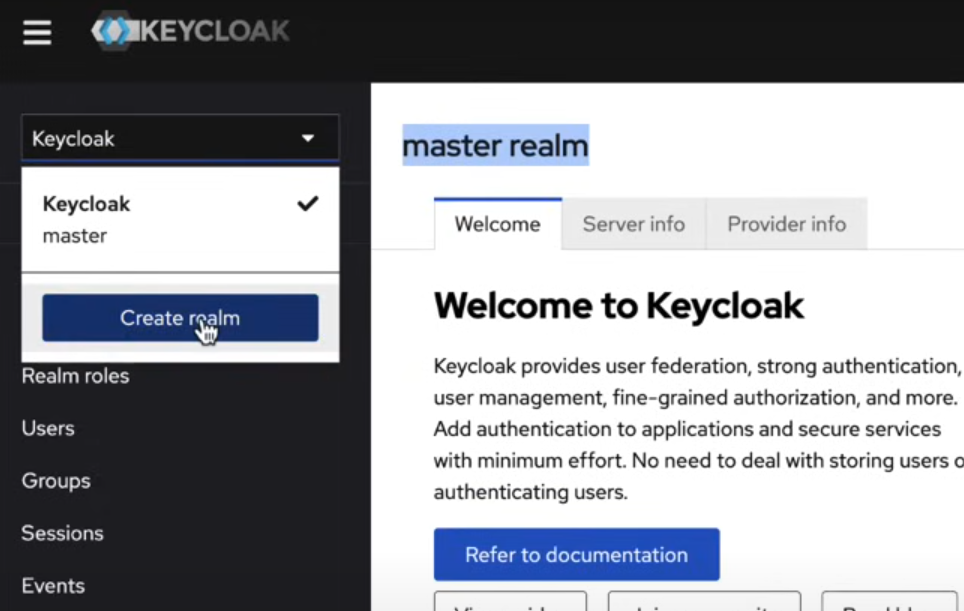
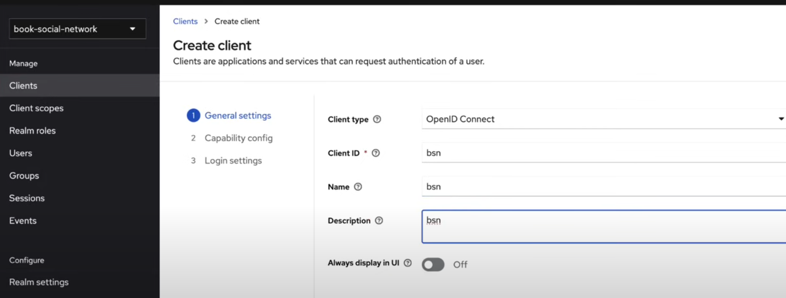
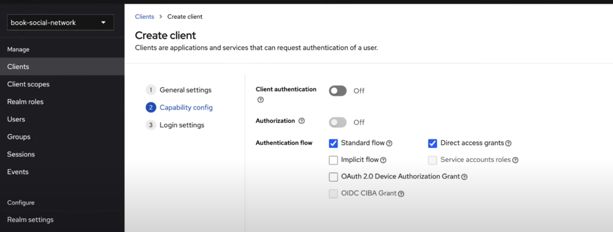
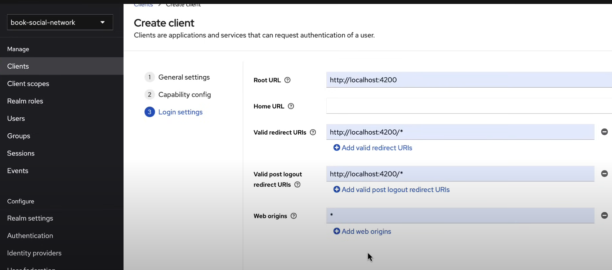
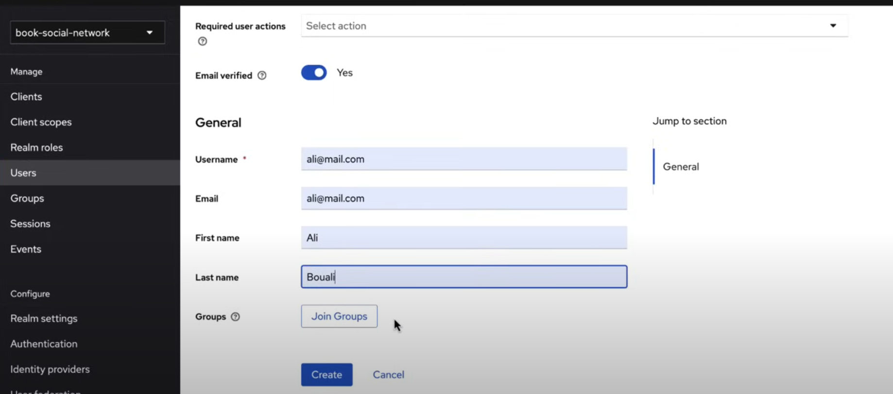
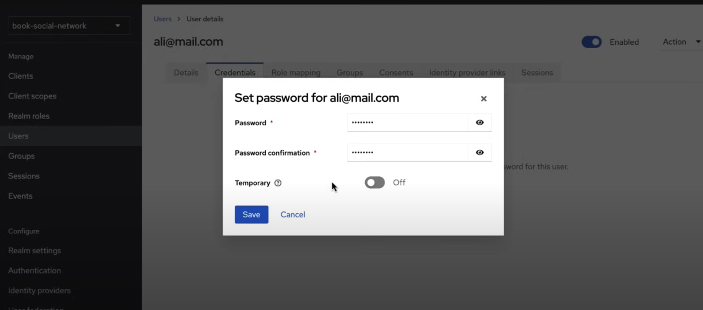

# selene
Livraria Pública

## Configuração do Projeto no Keycloak

Referências:
- [KEYCLOAK with Spring Boot & Angular | Step by Step Guide](https://www.youtube.com/watch?v=Ppkys9dKadA&t=4479s)
- [Projeto Book Social Network](https://github.com/ali-bouali/book-social-network)
  

## Crie o Realm No Keycloak

 - Vá á url localhost:9090, use as credenciais **_admin_** para usuário e **_admin_** para senha.
 - Crie um realm com o nome 
 
 -  Crie o realm **__book-social-network__**
  
 -----------------

### Criação do Cliente no Keycloak 
Preencha a primeira tela com as seguintes informações __em general settings__:
  - **Client type**: _OpenId Connect_
  - **Client ID** : _bsn_
  - **Name** : _bsn_
  - **Description** : _bsn_

Nessa Segunda Tela,**Capability Config**, marque as seguintes opções:
 - Cliente Authentication : __Off__
 - [x] Standard Flow: __Deixa marcado__
 - [x] Direct Access Grants: __Deixa marcado__

Na terceira e última tela, __Login settings__, marque conforme o texto e a imagem de apoio.
- **Root URL**: http://localhost:4200
- **Valid redirect URIs**: http://localhost:4200/*
- **Valid post logout redirect URIs**: http://localhost:4200/*
- **Web origins**: *

-----------------------

### Criação de Usuários
Siga a tela abaixo como exemplo.

- Selectione a aba **Credentials** para configurar uma senha:

